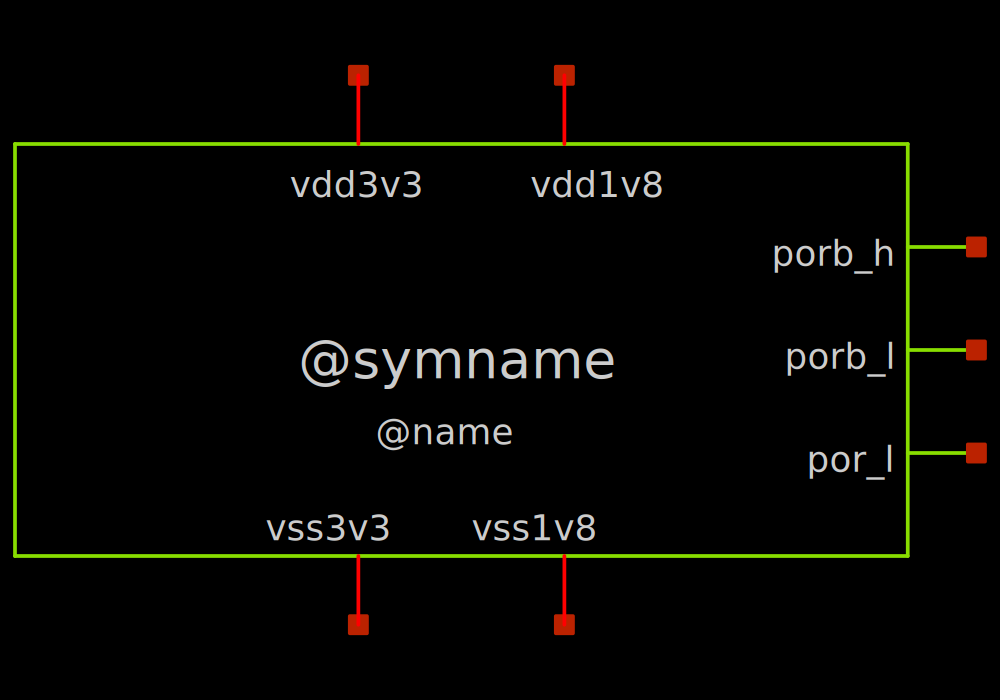
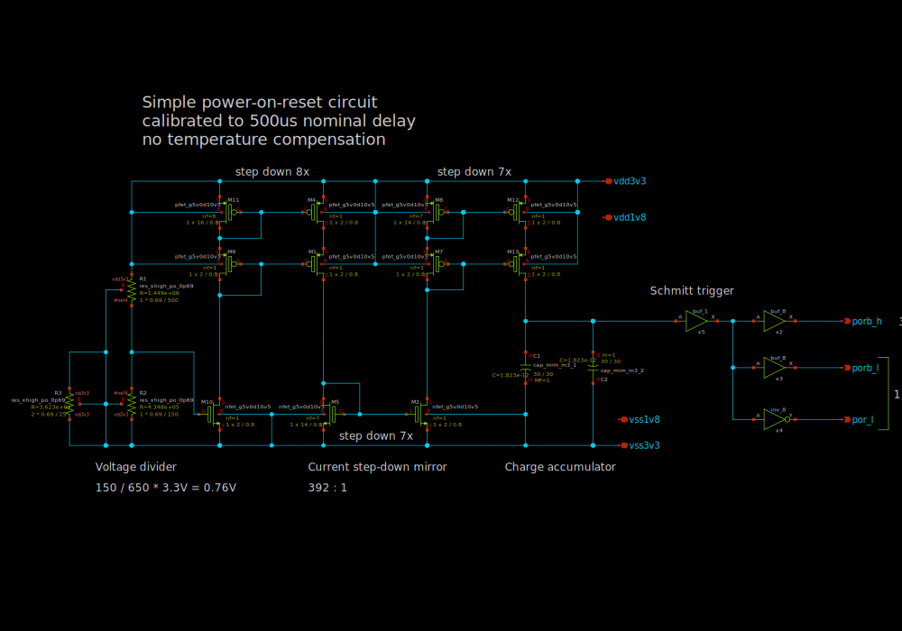
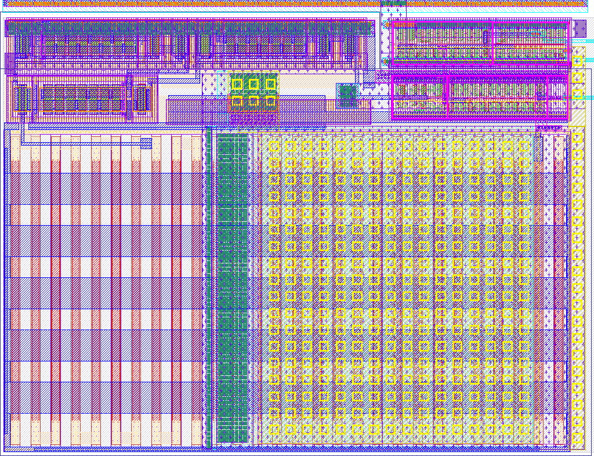
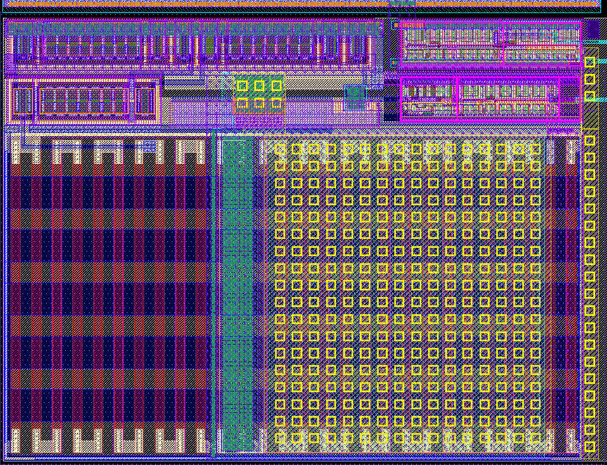

# sky130_ef_ip__simple_por

- Description: Simple PoR based on an RC filter
- PDK: sky130A

## Authorship

- Designer: Leo Moser
- Company: Efabless
- Created: November 20, 2024
- License: Apache 2.0
- Last modified: None

## Pins

- vdd3v3
  + Description: Analog power supply
  + Type: power
  + Direction: inout
  + Vmin: 3.2
  + Vmax: 3.4
- vss3v3
  + Description: Analog ground
  + Type: ground
  + Direction: inout
- vdd1v8
  + Description: Digital power supply
  + Type: power
  + Direction: inout
  + Vmin: 1.7
  + Vmax: 1.9
- vss1v8
  + Description: Digital ground
  + Type: ground
  + Direction: inout
- porb_h
  + Description: Power on reset, inverted (3.3V)
  + Type: signal
  + Direction: output
- porb_l
  + Description: Power on reset, inverted (1.8V)
  + Type: signal
  + Direction: output
- por_l
  + Description: Power on reset, non-inverted (1.8V)
  + Type: signal
  + Direction: output

## Default Conditions

- avdd
  + Description: Analog power supply voltage
  + Display: Avdd
  + Unit: V
  + Typical: 3.3
- dvdd
  + Description: Digital power supply voltage
  + Display: Dvdd
  + Unit: V
  + Typical: 1.8
- corner
  + Description: Process corner
  + Display: Corner
  + Typical: tt
- temperature
  + Description: Ambient temperature
  + Display: Temp
  + Unit: °C
  + Typical: 27

## Symbol

## Schematic

## Layout

