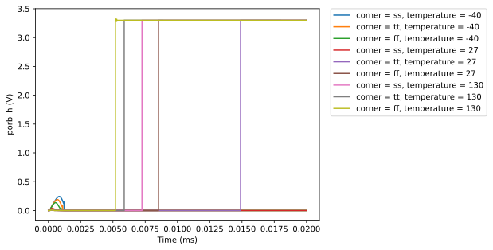

# CACE Summary for sky130_ef_ip__simple_por

**netlist source**: schematic

|      Parameter       |         Tool         |     Result      | Min Limit  |  Min Value   | Typ Target |  Typ Value   | Max Limit  |  Max Value   |  Status  |
| :------------------- | :------------------- | :-------------- | ---------: | -----------: | ---------: | -----------: | ---------: | -----------: | :------: |
| Area                 | magic_area           | area                 |               ​ |          ​ |            ​ |          ​ |          any |          ​ |   Skip 🟧    |
| Width                | magic_area           | width                |               ​ |          ​ |            ​ |          ​ |          any |          ​ |   Skip 🟧    |
| Height               | magic_area           | height               |               ​ |          ​ |            ​ |          ​ |          any |          ​ |   Skip 🟧    |
| Magic DRC            | magic_drc            | drc_errors           |               ​ |          ​ |            ​ |          ​ |            0 |          ​ |   Skip 🟧    |
| Netgen LVS           | netgen_lvs           | lvs_errors           |               ​ |          ​ |            ​ |          ​ |            0 |          ​ |   Skip 🟧    |
| KLayout DRC feol     | klayout_drc          | drc_errors           |               ​ |          ​ |            ​ |          ​ |            0 |          ​ |   Skip 🟧    |
| KLayout DRC beol     | klayout_drc          | drc_errors           |               ​ |          ​ |            ​ |          ​ |            0 |          ​ |   Skip 🟧    |
| KLayout DRC full     | klayout_drc          | drc_errors           |               ​ |          ​ |            ​ |          ​ |            0 |          ​ |   Skip 🟧    |
| Antenna Checks       | magic_antenna_check  | antenna_violations   |               ​ |          ​ |            ​ |          ​ |            0 |          ​ |   Skip 🟧    |

## Plots

## transient

